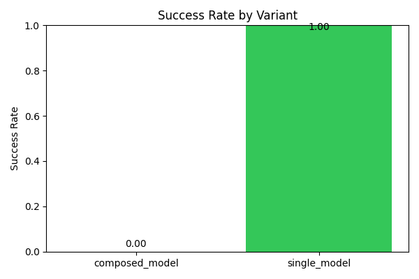
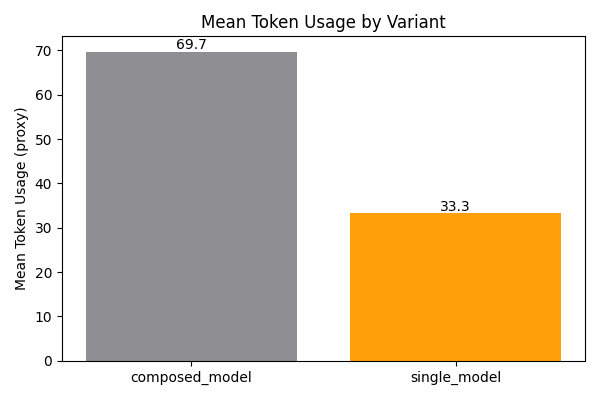

# Experiment Report

_Generated: 2025-11-03T22:05:16.587308+00:00_

## Introduction

This report compares a single-model baseline to a composed pipeline using automated decomposition.

## Methods

We evaluate two variants: a single-model baseline and a composed pipeline using automated decomposition. Accuracy is approximated by keyword matches; success is 1.0 accuracy; token usage is a proxy estimate.

## Models

- Single model: SingleMock
- Weak model:   WeakMock
- Strong model: StrongMock

## Safety

All prompts and outputs pass a conservative safety filter. Unsafe content is blocked or redacted. No instructions for harmful activities or explicit imagery are produced.

## Results

### Summary Table

| variant | accuracy | success_rate | mean_token_usage | count |
| --- | --- | --- | --- | --- |
| composed_model | 0.5 | 0.0 | 69.66666666666667 | 9 |
| single_model | 1.0 | 1.0 | 33.333333333333336 | 9 |

### Sample Rows

| variant | prompt | output | accuracy | success | tokens |
| --- | --- | --- | --- | --- | --- |
| single_model | Outline safe steps for data cleaning | [MOCK:SingleMock] Provide a brief, safe response. Avoid any sensitive or harmful content. TASK: Outline safe steps for data cleaning | 1.0 | True | 33 |
| composed_model | Outline safe steps for data cleaning | [MOCK_SOLVED:StrongMock] Outline approach for Outline safe steps for

[MOCK_SOLVED:StrongMock] Execute key steps for Outline safe steps for

[MOCK_SOLVED:StrongMock] Summarize results for Outline safe steps for | 0.5 | False | 66 |
| single_model | Classify safe customer feedback into themes | [MOCK:SingleMock] Provide a brief, safe response. Avoid any sensitive or harmful content. TASK: Classify safe customer feedback into themes | 1.0 | True | 34 |
| composed_model | Classify safe customer feedback into themes | [MOCK_SOLVED:StrongMock] Outline approach for Classify safe customer feedback

[MOCK_SOLVED:StrongMock] Execute key steps for Classify safe customer feedback

[MOCK_SOLVED:StrongMock] Summarize results for Classify safe customer feedback | 0.5 | False | 75 |
| single_model | Summarize safe article on productivity | [MOCK:SingleMock] Provide a brief, safe response. Avoid any sensitive or harmful content. TASK: Summarize safe article on productivity | 1.0 | True | 33 |
| composed_model | Summarize safe article on productivity | [MOCK_SOLVED:StrongMock] Outline approach for Summarize safe article on

[MOCK_SOLVED:StrongMock] Execute key steps for Summarize safe article on

[MOCK_SOLVED:StrongMock] Summarize results for Summarize safe article on | 0.5 | False | 68 |
| single_model | Summarize safe article on productivity | [MOCK:SingleMock] Provide a brief, safe response. Avoid any sensitive or harmful content. TASK: Summarize safe article on productivity | 1.0 | True | 33 |
| composed_model | Summarize safe article on productivity | [MOCK_SOLVED:StrongMock] Outline approach for Summarize safe article on

[MOCK_SOLVED:StrongMock] Execute key steps for Summarize safe article on

[MOCK_SOLVED:StrongMock] Summarize results for Summarize safe article on | 0.5 | False | 68 |
| single_model | Classify safe customer feedback into themes | [MOCK:SingleMock] Provide a brief, safe response. Avoid any sensitive or harmful content. TASK: Classify safe customer feedback into themes | 1.0 | True | 34 |
| composed_model | Classify safe customer feedback into themes | [MOCK_SOLVED:StrongMock] Outline approach for Classify safe customer feedback

[MOCK_SOLVED:StrongMock] Execute key steps for Classify safe customer feedback

[MOCK_SOLVED:StrongMock] Summarize results for Classify safe customer feedback | 0.5 | False | 75 |

## Discussion

Briefly interpret the results, noting where composition helps or harms performance and cost.

## Limitations

Keyword-based accuracy is a coarse proxy; token estimates are approximate; mock models are deterministic.

## Ethics

All experiments prioritize safety. We avoid generating harmful, illicit, or explicit content and apply defense-in-depth filtering.
